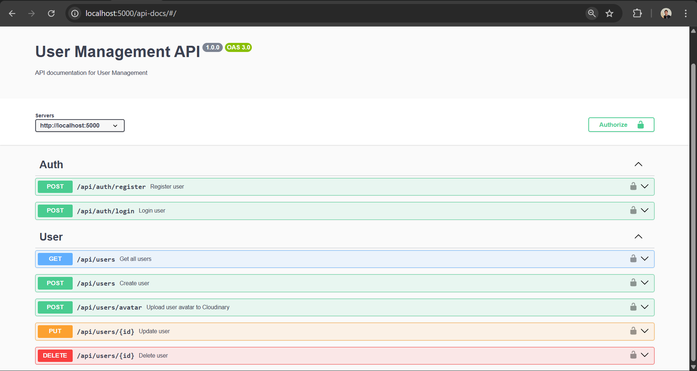
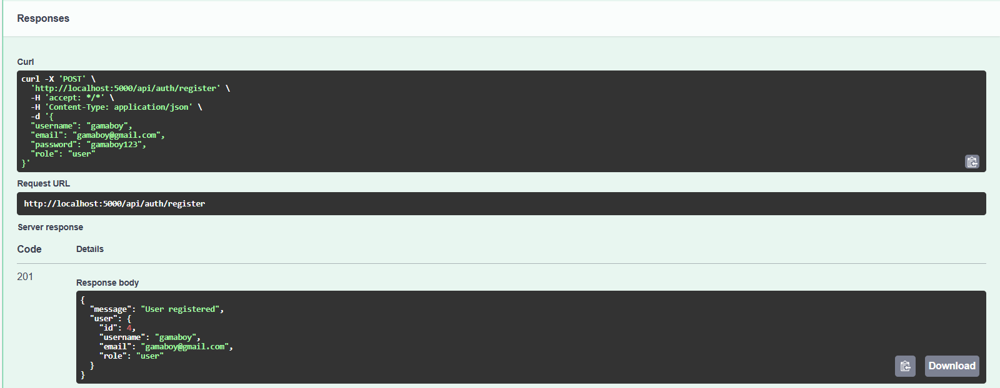
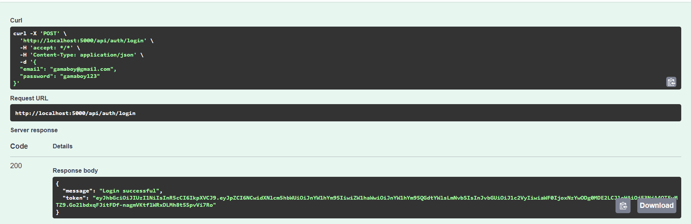

# User Management API dengan PostgreSQL & Cloudinary

Proyek ini adalah implementasi RESTful API dengan autentikasi JWT, CRUD data user, upload foto profil ke Cloudinary, serta keamanan server menggunakan CORS dan Helmet.

- **Nama:** Refa Setyagama Abdillah
- **Mentor:** Imam Fadhilah

---

## Deskripsi Proyek

API ini dikembangkan untuk mengelola data **User** dengan fitur:
- Register & Login (JWT Authentication)
- CRUD data user (Create, Read, Update, Delete)
- Upload foto profil (Cloudinary)
- Keamanan server menggunakan CORS dan Helmet
- Validasi input dan penanganan error

---

## Teknologi yang Digunakan

- Node.js & Express.js  
- PostgreSQL  
- JWT (jsonwebtoken)  
- bcryptjs (hash password)  
- Cloudinary & Multer  
- CORS & Helmet  
- dotenv untuk konfigurasi environment

---

## Persiapan dan Instalasi

1. **Clone Repository**
   ```bash
   git clone https://github.com/gamastronger/user_management_api.git
   cd user_management_api
2. **Install Dependencies**
   ```bash
   npm install
3. **Buat Database**
   Jalankan query berikut di PostgreSQL:
   ```bash
   CREATE TABLE users (
   id SERIAL PRIMARY KEY,
   username VARCHAR(100) UNIQUE NOT NULL,
   email VARCHAR(100) UNIQUE NOT NULL,
   password VARCHAR(255) NOT NULL,
   role VARCHAR(50) DEFAULT 'user',
   avatar_url TEXT,
   updated_at TIMESTAMP DEFAULT CURRENT_TIMESTAMP
   );
4. **Buat .env**
   ```bash
   PGUSER=postgres
   PGHOST=localhost
   PGDATABASE=my_database
   PGPASSWORD=your_password
   PGPORT=5432
   JWT_SECRET=your_jwt_secret
   CLOUDINARY_NAME=your_cloud_name
   CLOUDINARY_KEY=your_api_key
   CLOUDINARY_SECRET=your_api_secret
5. **Jalankan Server**
   Jalankan Server
   ```bash
   npm run dev

## READY TEST POSTMAN
[Lihat Dokumentasi User Management API di Postman](https://documenter.getpostman.com/view/40828760/2sB3QQKoMQ)

## Preview Screenshot

### Cloudinary Media Library
ini adalah tampilan penyimpanan Media Library Website Cloudinary, menampilkan seluruh file yang sudah diunggah oleh user


### API Swagger Documentation
Tampilan dari Dokumentasi API Swegger


### API Swagger Register
Response Testing Register Swegger


### API Swagger Login
Response Testing Login Swegger


### Error Handling
Mekanisme API untuk memberikan pesan kesalahan ("Username, email, password, dan role wajib diisi") kepada pengguna ketika permintaan POST yang dikirim tidak memiliki semua data wajib.

